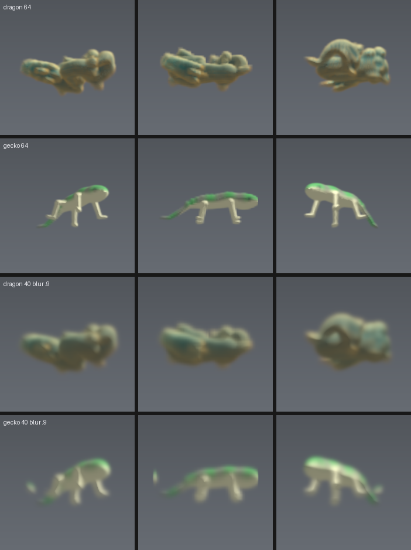
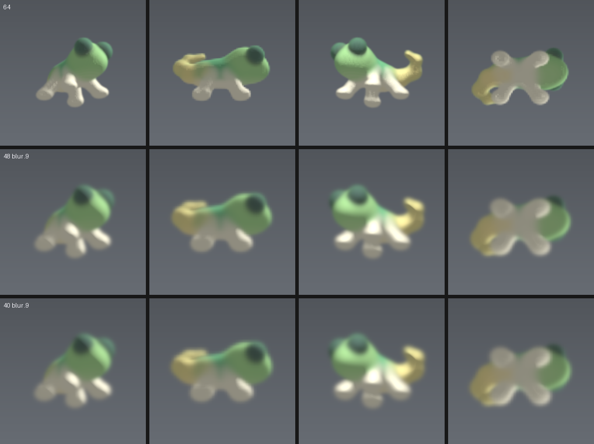

# Growing a gecko

Fitting the volume page's rule so that a small seed grows into a 3D animal, the
way the flat page's lizard was fitted to an emoji.

| | |
|---|---|
| `cute.py` | **the target**: a cartoon gecko, big head and big eyes, cut into eight parts that do not overlap |
| `kernel_cppn.py` | the kernel bank: rings and angular orders drawn by a small network, each channel with its own reach |
| `gecko.py` | the first target: a realistic lizard, in three parts. Kept for the SDF helpers everything else imports |
| `dragon.py`, `bake_mesh.py`, `glb.py`, `voxelise.py`, `colour.py` | a free mesh as a target instead: read the glTF, fill it, colour it off its own geometry |
| `field3d.py` | the page's step written again in torch, so it can be differentiated |
| `train_gecko.py` | the fit: unroll from a seed, compare, push the error back |
| `export_fit.py` | writes the fitted rule out in the units the page reads |
| `render_fit.py`, `look.py`, `view.py` | look at what grew |
| `sheet.py` | contact sheets: `stages` compares every attempt against the target, `growth` follows one from its seed |

```
pip install torch numpy pillow
python3 train_gecko.py --target cute --kernel cppn --K 7 --N 40 \
    --iters 900 --warm 26 --chunk 12 --pool 16 --batch 4 \
    --lr 4e-3 --wsil 2.5 --wout 6.0 --blur 0.9 --seedR 2.6 --out cuteK.json
python3 look.py cuteK.pt 18,32,44 40 out.png --target cute
```

`--target` is any module with a `build_parts(N)` that hands back pieces which do
not overlap and sum to the whole. How many pieces is the target's business: the
fit reads it off the stack and sizes the field to match.

## Every chemical is part of the animal

There are no hidden channels. `--hidden` can add some, but it defaults to none,
so the field carries exactly as many chemicals as the target has parts and each
one of them is a piece of the gecko you can see.

That is a real restriction and it is worth being clear about what it costs. A
fit given spare channels will use them, and what it uses them for is scaffolding
-- a chemical that sits in the empty space around the animal and holds its shape
from outside, invisible in the picture and load-bearing in the rule. It makes
the fit easier and it makes the result a lie: what you are looking at is not
what is there, and the thing you would put on the page is not the thing that was
trained.

So the channels are the parts, and on top of that `--wout` prices any mass that
ends up outside the body at all. The loss reports it as `out`, the fraction of
everything the field is carrying that is sitting somewhere the gecko is not. It
starts near a half, because a seed is a ball and a ball is mostly not a gecko.

## The kernel bank: rings, orders, and big and small together

The flat page writes a kernel as a sum of lobes, each one
`a * exp(-((r - r0)/w)^2) * cos(m*theta + phase)`: a ring at some radius, times
an angular order about some phase. Both halves matter and neither survives the
move to three dimensions unchanged.

**The angular part.** `cos(m*theta + phase)` needs a single angle, and in three
dimensions there isn't one. What does generalise is the thing the phase stood in
for: a DIRECTION. Project the offset onto a learned unit axis and take Chebyshev
polynomials of the projection, and that is exactly `cos(m * angle to that axis)`
-- an angular order about an axis that can point anywhere, where a phase could
only slide round one circle.

**The radial part.** A tanh network over `r` is smooth and a ring is not, so the
radius goes in as a Fourier basis: cos and sin of a few multiples of `pi*r`.
Each is already a set of concentric shells across the kernel's reach, and a
weighted sum of them is any ring pattern the fit wants, sharp ones included.

**Big and small.** Each channel carries its own reach, and the reaches start
spread right across the range rather than clustered: at `K=7` that is a kernel
about two cells across at one end of the bank and thirteen at the other. One
stencil holds both, because a channel's offsets are measured in units of its own
reach before they reach the network.

Those features, the raw offset and a per-channel embedding go into a small MLP
with a per-channel readout, which is evaluated at every offset to draw that
channel's kernel. `python3 kernviz.py cuteK.pt kernels.png` draws the bank.

Three things make it affordable, and without them it is not:

- **The bank is baked once per unroll, not once per step.** It does not change
  inside one, and drawing it costs more than using it. This alone was most of
  the cost.
- **The convolution goes through an FFT.** The world is a torus, so the wrapped
  convolution the page wants is exactly what a transform gives. A dense
  fifteen-cubed stencil is three thousand multiplies a voxel done directly.
- **The crowding blur adds the channels up before blurring rather than after.**
  A blur is linear, so it is the same number for a fraction of the work, and
  the twenty-seven neighbour sum is three shifts along each axis rather than a
  twenty-seven tap convolution, for the same reason.

## Why the target is a cartoon

The blur is the whole of it. At forty cubed a cell is a fortieth of the world
and the target is softened by about a cell before the fit ever sees it, because
the kernels are Gaussians a cell or two wide and cannot hold anything finer. So
detail does not survive. SILHOUETTE does.

That is a hard constraint on what is worth aiming at, and it does not reward
realism. Here is the Khronos dragon -- a far more intricate animal than anything
drawn here -- next to the first lizard, each at sixty-four cubed and then at the
forty cubed the fit runs at:



The dragon loses. All of its interest is in coils and scales at the scale of one
cell, and its own folds close up under the blur; it arrives as a lump. The
lizard keeps its legs and its tail, because those are the only things about it
that were ever bigger than three cells.

A cartoon is the shape that wins this argument outright. A head nearly as big as
the body, eyes that stand clear of it, four stubby legs, a fat curled tail:
every mass is large, every gap between them is large, and the thing is designed
to be recognisable from a distance, which is exactly what a blur leaves you
with. Cute is, here, the same thing as legible.



## What the rule had to grow to allow this

The page's kernel is a difference of two Gaussians. That is radially symmetric,
and a bank of radially symmetric kernels has only radially symmetric fixed
points — it cannot hold anything shaped like an animal. So a kernel here is a
sum of Gaussians **moved off centre**:

    K_c = sum_t  a[c,t] * G_sigma(t)( rho_c )  read at  p + o[c,t]

which is still separable. The blurs are shared by every channel and every term,
and a displacement is free — it is only where you read the result. A handful of
displaced blobs of a few widths describes a thoroughly lopsided kernel, and the
bank costs three separable passes per width plus one gather of T taps. Nothing
else about the step changes, and mass is still conserved to the digit.

## Three things the fit taught, each of which cost a run

**Force is not a detail.** Below about ten the field simply diffuses, the animal
never forms, and the gradient through twenty steps dies with it. Above it the
field holds structure and the gradient survives the whole unroll. The affinity
is divided by the mean density here so force means the same thing whatever the
animal weighs — in three dimensions an animal is about a hundredth of the cube
where on a sheet it is a good fraction of it.

**The target has to be reachable.** The kernels are Gaussians a cell or two
wide, so the smallest thing the rule has a fixed point for is about that size. A
target with finer detail is not a hard target, it is an impossible one, and
asking for it buys a compromise that satisfies nothing. Blurred by about a cell
the gecko still reads as a gecko — legs, tail, head — and is inside what the
rule can do.

**Colours are species, and species separate.** Three channels carrying red,
green and blue at the same voxel is a picture the rule is built not to hold, and
a fit asked for it spends its whole budget losing that argument — visibly, as
rainbow fringes on a body that never becomes a body. So the animal is cut into
parts that do not overlap: back, underside, head. They sum to the whole, each
channel gets a region of its own, and the picture is put back together at the
far end by giving each part a colour, which is what every other world on the
page already does.

## Where it has got to

Nine hundred iterations against the cartoon gecko, with the ring bank and no
hidden channels, grows **a stable lump**. The colours have begun to separate
along it -- green at one end, cream through the middle -- and the mass outside
the animal falls from 0.42 to 0.06, so almost everything the field carries is
inside the silhouette. It holds its shape at step 12, 26 and 44 alike, so it is
a genuine fixed point and not somewhere the field is passing through. But there
is no gecko in it: no head, no legs, no tail.

That is the same wall the three-part fit hit, and the history below is what is
known about it. What has changed is that testing the usual answer is now cheap.

**How much an iteration costs, which is no longer the thing in the way.** Nine
hundred iterations took fifteen and a half minutes on four CPU cores -- about a
second each, where the displaced-Gaussian fit took nine. Nearly all of that came
from three things that were being paid for nothing: baking the kernel bank every
step instead of once per unroll, convolving a dense stencil directly instead of
through a transform, and blurring every channel for the crowding term instead of
their sum. Tens of thousands of iterations is now an afternoon here rather than
a week, which makes "it simply needs more of them" a claim that can be checked
rather than assumed.

**The pattern was not a stable fixed point.** The first runs lengthened the
unroll as they went and the loss jumped every time they did: a rule tuned to
look right at step 32 did not hold at step 36, because it had never been asked
to stop. Run it past where it was trained and the animal kept going, into
something else.

`--pool` is the fix, and it works. Keep a bag of states the rule has already
made, start from one of those as often as from the seed, and score where it
gets to fourteen steps later. A state that is already the animal is then scored
on whether it is still the animal afterwards, which is the only way a fixed
point gets learned. The measure that matters is the loss on those pool
restarts, and over the run it falls steadily:

    pool restarts   1- 15   mean 0.101
                   16- 30   mean 0.098
                   31- 45   mean 0.092
                   46- 60   mean 0.078
                   61- 75   mean 0.057

and the picture stops moving: run from the seed, the shape at step 20, step 40
and step 70 is the same shape. Before the pool it was three different ones.

The cost is that what it holds is *simpler* than what it reached before —
persistence pressure likes smooth attractors, and it found one before it found
a gecko.

And here is the part worth knowing before spending a night on this: **the extra
training did not buy the shape back.** A thousand more pool iterations took the
restart loss from 0.078 to 0.057, and the picture at the end of them is the
picture at the start — the same slab, held more precisely. The improvement went
into polishing the attractor it had already found, not into leaving it. So
"just run it longer" is not, on this evidence, the whole answer.

What that points at is the balance between the two pressures rather than the
amount of either. Once the pool is filling, nearly every iteration is a short
restart from a state that is already smooth, and the long run from the seed --
the only one that ever has to *build* anything -- is a fifth of the batch and
gets a fifth of the gradient. Things to try, in order: hold the fresh fraction
high and decay it slowly rather than fixing it at a fifth; weight the fresh
iterations up in the loss; and keep the silhouette term climbing while the pool
term holds, so persistence is bought without paying for it in shape.

Those are all in now. The fresh fraction starts at `--fresh0` and decays to
`--fresh` over the run, so the early iterations are nearly all building and the
late ones are nearly all holding; `--wfresh` weights a run from the seed above a
restart in the loss; and the restarts go through the unroll as a `--batch`
rather than one at a time, since they all run the same number of steps. Whether
that is enough is a question about iterations, and the answer to that one is
below.

## Running it on a GPU

Everything here is device-agnostic now — the model asks its own parameters where
they live rather than remembering a string, so `.to("cuda")` works:

```
python3 train_gecko.py --device cuda --target cute --kernel cppn --K 7 \
    --N 48 --iters 20000 --warm 30 --chunk 14 --pool 32 --batch 16 \
    --lr 3e-3 --wsil 2.5 --wout 6.0 --blur 0.9 --out cuteG.json
python3 look.py cuteG.pt 20,34,48 48 out.png --target cute
```

`cuteK900.pt` is committed so a run can pick up where the CPU left off rather
than start over. Nothing about the shape needs to be passed on the command line
when resuming or looking: `load_field` reads how many channels, how wide the
seed and how big the stencil straight out of the file, because the flags that
made a run are the first thing forgotten about it.

What the hardware is worth here is smaller than it was, because most of what
looked like a hardware problem turned out to be arithmetic being repeated. An
iteration is about a second on four CPU cores at 40 cubed with eight channels;
the same thing is a
few tens of milliseconds on a current card, and 48 or 64 cubed becomes
affordable at the same time. This whole page's worth of conclusions was drawn
from runs of a few hundred iterations. Fits of this kind normally get tens of
thousands, and the one thing every result here points at is that the fit has not
had enough of them.

`--batch` is written now, and on a card it is close to free -- sixteen restarts
through the unroll at once where the processor does four. That is where the
number above comes from.

## Not on the page yet

Nothing has been added to `staging/volume.html` for this, deliberately. The page
would need the displaced-Gaussian bank, a gather pass, and a seed that is a
small pattern rather than a ball — a contained change, but not one worth making
to a page that works until there is a gecko to put in it.
